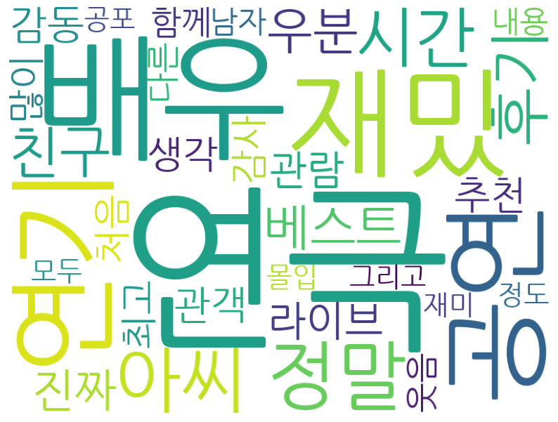
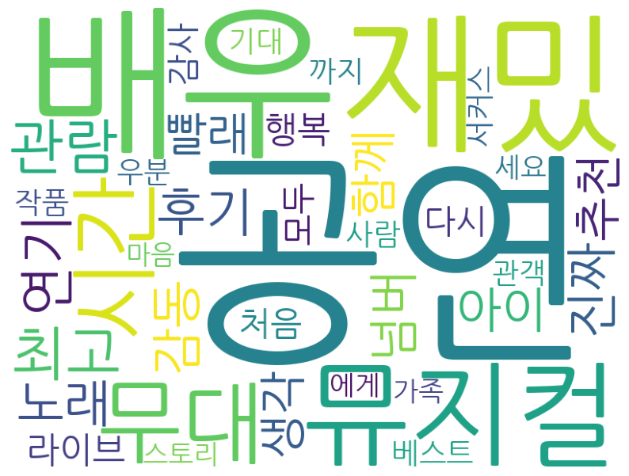
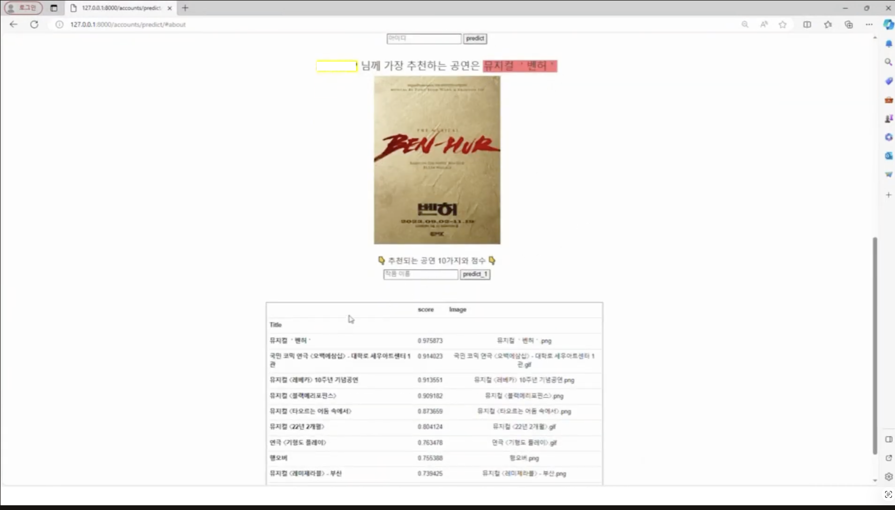

# 🎭 텍스트(리뷰·줄거리)와 이미지(포스터) 데이터를 활용한 멀티모달 기반 공연 추천 시스템

## 📌 프로젝트 개요

본 프로젝트는 연극·뮤지컬 공연을 대상으로
사용자 맞춤형 추천 시스템을 구현하는 것을 목표로 진행한 캡스톤 디자인 프로젝트입니다.

기존 공연 추천 서비스가 지역이나 기간 중심으로 제공되는 점에서 한계를 느꼈고,
이를 개선하기 위해 리뷰 데이터와 공연 포스터 이미지를 함께 활용한
멀티모달 기반 추천 시스템을 설계하였습니다.

---

## 🎯 프로젝트 목표

* 사용자 취향을 반영한 공연 추천 시스템 구현
* 텍스트와 이미지 정보를 함께 활용한 추천 모델 설계
* 협업 필터링과 콘텐츠 기반 필터링을 결합한 하이브리드 추천 방식 적용

---

## 📊 데이터 수집 및 구성

* 인터파크, PlayDB에서 연극·뮤지컬 Top 70 공연 데이터 수집
* 리뷰 데이터 (유저 ID, 평점, 리뷰, 날짜)
* 공연 포스터 이미지 크롤링
* OCR을 활용하여 포스터 내 줄거리 텍스트 추출

---

## 📊 리뷰 데이터 분석 (Word Cloud)

### 🎭 연극 리뷰

### 🎤 뮤지컬 리뷰

👉 리뷰 데이터를 시각화하여 공연에 대한 주요 키워드와 감성 표현을 확인하였습니다.
---

## ⚙️ 기술 스택

* Python, Pandas, NumPy
* Scikit-learn
* Django
* SBERT (텍스트 임베딩)
* VGG16 (이미지 feature 추출)
* OCR

---

## 👥 사용자 유형별 추천 전략

본 프로젝트는 사용자 데이터를 기준으로 두 가지 추천 방식을 구분하여 설계하였습니다.

### 🔹 신규 사용자 (Cold Start)

* 사용자의 관람 이력이 없는 경우
* 공연의 장르, 줄거리, 이미지 정보를 기반으로 유사 공연 추천
* 멀티모달 기반 콘텐츠 추천 방식 적용

### 🔹 기존 사용자

* 사용자의 관람 이력 및 평점 데이터 활용
* 협업 필터링 + 콘텐츠 기반 필터링 결합
* 개인화 추천 성능 향상

---

## 🔍 모델 구성

### ✔ 협업 필터링 (CF)

* 사용자-아이템 행렬 구성 (공연 × 사용자 평점)
* 코사인 유사도를 활용한 아이템 기반 추천
* 미관람 공연에 대한 예측 평점 계산 후 추천

---

### ✔ 콘텐츠 기반 필터링 (CBF)

* 장르, 줄거리, 배우, 평점 정보 활용
* 장르: TF-IDF 기반 벡터화
* 줄거리: SBERT 임베딩
* 이미지: VGG16으로 특징 추출

각 요소에 가중치를 부여하여 최종 추천 점수를 계산하였습니다.

---

### ✔ 멀티모달 & 하이브리드 모델

* 텍스트와 이미지 feature를 결합하여 유사도 계산
* 협업 필터링 결과와 콘텐츠 기반 결과를 함께 활용

👉 두 방식을 결합하여 cold-start 문제를 완화하고, 사용자 데이터 유무에 관계없이 안정적인 추천 성능을 확보하고자 하였습니다.

---

## 📈 성능 평가

* 평가 지표: Hit Rate, Precision

| 사용자 유형     | Precision | Hit Rate |
| ---------- | --------- | -------- |
| 연극 중심 사용자  | 0.5       | 0.45     |
| 뮤지컬 중심 사용자 | 0.4       | 0.36     |
| 혼합 사용자     | 0.5       | 0.83     |

사용자 유형에 따라 추천 성능 차이가 나타나는 것을 확인했습니다. 

👉 특히 연극과 뮤지컬을 균형 있게 소비한 사용자에서 가장 높은 성능이 나타났으며,
다양한 콘텐츠를 경험한 사용자일수록 추천 정확도가 향상되는 경향을 확인했습니다.

---

## 💻 서비스 구현

* Django 기반 웹 서비스 형태로 프로토타입 구현
* 작품명 또는 사용자 ID 입력 시 추천 결과 제공
* 추천 점수 및 결과 확인 가능

👉 사용자가 입력한 공연과 유사한 작품을 추천하고, 각 공연에 대한 추천 점수를 함께 제공
---

## 🙋‍♀️ 나의 역할 (기여도 40%)

* 인터파크 및 PlayDB 데이터 크롤링
* OCR 기반 줄거리 추출 및 전처리
* 텍스트/이미지 feature 추출 과정 참여
* 추천 모델 설계 및 구현 참여
* 웹 서비스 구현 일부 참여

---

## 💡 한계 및 개선 방향

* 데이터 수가 적어 모델 일반화에 한계 존재
* 공연별 리뷰 수 편차가 큼
* 신규 사용자 추천 성능 평가 어려움

→ 향후 더 다양한 사용자 데이터 확보 필요

---

## 📝 느낀점

텍스트와 이미지 데이터를 함께 활용하면서
단순 추천보다 더 다양한 기준을 고려할 수 있다는 점이 인상적이었습니다.

특히 데이터 전처리와 feature 추출 과정이
모델 성능에 큰 영향을 준다는 것을 직접 경험할 수 있었습니다.

또한 멀티모달 데이터를 활용한 추천 시스템 설계를 통해,
단일 데이터 기반 모델보다 더 풍부한 사용자 경험을 제공할 수 있음을 확인했습니다.
